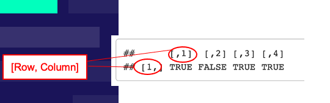
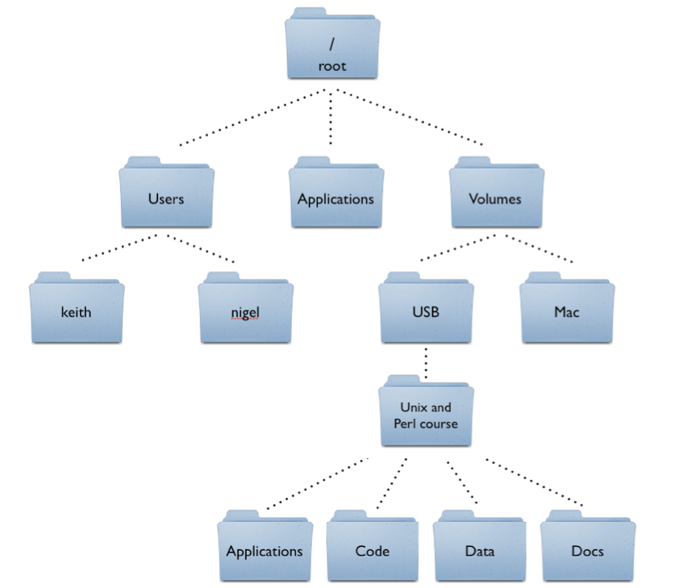

# Introduction

Welcome to the COMM Jumpstart inaugural R basics workshop

# **Basic Functionality and a Brief Introduction to Object-Oriented Programming**

**Basic Functionality** 

Although R is frequently used to accomplish amazing feats of statistical analysis and data visualization, when starting out it is best to learn to use R as though it were a fancy calculator. 

R can do everything that a calculator can do:

```{r}
6 + 2 # it can preform addition
```

```{r}
5 - 3 #  subtraction 
```

```{r}
6 * 2 # multiplication 
```

```{r}
3/4 # division 
```

```{r}
6**2 # and exponentiation
```

Furthermore, it has the ability to place the results of these calculations into an "object", allowing you to save the value for later.

```{r}
x = 6 + 3 
print(x)
```

### Object Oriented Programming

These objects are extremely important as R is an object oriented programming language. In short, object-oriented programming languages provide a way to store data within objects, by encapsulating data and functions that operate on that data together. This allows for a clear and organized structure for the code, making it easier to understand, maintain, and reuse.

#### R has many arithmetic, comparison, and logical operators

**Arithmetic Operators**

-   \`+\` : Addition

-   \`-\` : Subtraction

-   \`\*\` : Multiplication

-   \`/\` : Division

-   \`\^\` or \`\*\*\` : Exponentiation

-   \`%%\` : Modulus (remainder from division)

-   \`%/%\` : Integer Division

```{r}
# Examples:
a <- 10
b <- 3

a + b # Addition: 13
a - b # Subtraction: 7
a * b # Multiplication: 30
a / b # Division: 3.3333
a ^ b # Exponentiation: 1000
a %% b # Modulus: 1
a %/% b # Integer Division: 3
```

**Comparison Operators**

-   `==` : Equal to

-   `!=` : Not equal to

-   `>` : Greater than

-   `<` : Less than

-   `>=` : Greater than or equal to

-   `<=` : Less than or equal to

```{r}
# Examples:
a <- 10
b <- 3

a == b  # Equal to: FALSE
a != b  # Not equal to: TRUE
a > b   # Greater than: TRUE
a < b   # Less than: FALSE
a >= b  # Greater than or equal to: TRUE
a <= b  # Less than or equal to: FALSE
```

**Logical Operators**

-   `&` : Element-wise AND

-   `|` : Element-wise OR

-   `!` : NOT

-   `&&` : Logical AND

-   `||` : Logical OR

    ```{r}
    x <- TRUE
    y <- FALSE

    x & y   # Element-wise AND: FALSE
    x | y   # Element-wise OR: TRUE
    !x      # NOT: FALSE
    x && y  # Logical AND: FALSE
    x || y  # Logical OR: TRUE
    ```

# **R Basic Data Types & Structures**

**Data Types**

**There are five fundamental data types in R that you should be aware of:**

**1.) Logical:** TRUE, FALSE

-   Also denoted T or F logical data types can be used in conditional statements and can be used to filter or index data in a data frame or vector

```{r}
x <- 5
y <- 3

x > y # returns TRUE
```

**2.) Double:** 12.333, 40.3913, 1.0 

-   In R a double is one of the most common data types you will encounter. It is used to denote any real decimal number, also known as a **float**.

-   Similarly, the **numeric** data type also denotes any number. The **integer** data type denotes any non-floating point integer. 

-   Mostly, however, R will denote any numeric value as a double (or numeric)

```{r}
x <- 5 # an integer
y <- 3.14 # a double or floating point number
z <- 427 # another integer

typeof(x)
```

**3.) Character:** "Hello", "1", "FALSE"

-   The character data type is used to represent text or strings of data and is enclosed in either double or single quotes.

-   It is important to note that **if you place logical or a numeric data type in quotes, it becomes a character**

```{r}
x <- "Hello World!"
y <- 'I love coffee'
z <- "R is my favorite letter"

typeof(x)
```

**Data Structures**

**Vectors**

A vector is a list of the same type of data type. You can use the c() function to create a vector. 

```{r}
numbers <- c(1, 2, 3, 4, 5)
letters <- c("a", "b", "c")
logical_values <- c(TRUE, FALSE, TRUE)
```

**Matrices**

A matrix in R is a 2-dimensional data structure that contains elements of the same data type (e.g. numeric, character, logical).

```{r}
# using the character type
coffee_types <- c("Espresso", "Latte", "Cappuccino", "Macchiato")
coffee_matrix_1 <- matrix(coffee_types[1:2], ncol=2, byrow=TRUE)
coffee_matrix_2 <- matrix(coffee_types[3:4], ncol=2, byrow=TRUE)
coffee_matrix <- rbind(coffee_matrix_1, coffee_matrix_2) 
coffee_matrix
```

```{r}
# using numeric type 
coffee_prices <- c(2.50, 3.50, 4.00, 4.50)
price_matrix_1 <- matrix(coffee_prices[1:2], ncol=2, byrow=TRUE)
price_matrix_2 <- matrix(coffee_prices[3:4], ncol=2, byrow=TRUE)
price_matrix <- rbind(price_matrix_1, price_matrix_2)
price_matrix
```

```{r}
# using logical type
coffee_matrix <- matrix(c(TRUE, FALSE, TRUE, TRUE), ncol=4, byrow=TRUE)
coffee_matrix
```

```{r}
# You can also give names to the rows and columns of your matrix!
colnames(coffee_matrix) <- coffee_types
rownames(coffee_matrix) <- c("Avalible")

coffee_matrix
```

**A quick note about notation\...**

Matrices in R follow the format where the row number is listed first, followed by the column number



**Data Frames**

A data frame in R is a two-dimensional data structure that is used to store data, with rows representing observations and columns representing variables. It can handle a variety of data types including numeric, character, and logical values, and is one of the most common types of data structures in social science research. A few notes about data frames

1.  They are similar to matrices in that they have rows and columns, but unlike matrices, data frames can have different data types for each column

2.  They can be created from a variety of sources, such as CSV files, spreadsheets, or databases.

```{r}
coffee_types <- c("Espresso", "Latte", "Cappuccino", "Macchiato")
coffee_prices <- c(2.50, 3.50, 4.00, 4.50)
coffee_availability <- c(TRUE, FALSE, TRUE, TRUE)

coffee_dataframe <- as.data.frame(cbind(coffee_types, coffee_prices, coffee_availability))
coffee_dataframe
```

# **Functions**

Understanding functions (what they are, how to use them, how to make them) is one of the most important aspects of learning R.  

**What are Functions?!**

Functions in R are self-contained blocks of code that perform specific tasks, and are designed to accept inputs and return outputs. We have already used quite a few functions today. Some examples include: 

-   c() 

-   typeof() 

-   as.data.frame()

-   matrix()

Functions accept an input, and produce an output. 

1.  Inputs: Functions accept inputs, also known as arguments, which can be used to control the behavior of the function

2.  Functions return outputs, which can be used in other parts of the code or assigned to variables.

```{r}
# for example, the function sum takes a numeric input,
# and produces a sum of the numbers as its output
sum(4,5,19) 
```

**How do you use functions?**

To use a function, you have to call it. All this means is that you type in the name of the function followed by parentheses (see sum() example above). Next, you type in the arguments that the function asks for. If you want to get information on a specific function, type help(function name). For example, if I wanted help understanding the sum function, I would type: 

This results in a description of the function and it's usage in the files/plots/viewer/help panel of Rstudio 

```{r}
help(sum)
```

R has many functions, so many that I couldn't list them all here. However, here are some of the more useful ones: 

1.  c() - Concatenates elements into a vector. 

2.  mean() - Calculates the mean of a vector of numbers. 

3.  sum() - Calculates the sum of a vector of numbers. 

4.  sort() - Sorts a vector of numbers in ascending or descending order. 

5.  unique() - Returns unique values of a vector. 

6.  max() - Returns the maximum value of a vector. 

7.  min() - Returns the minimum value of a vector. 

8.  sqrt() - Returns the square root of a number. 

9.  round() - Rounds a number to a specified number of decimal places.

10.  head() - Returns the first n rows of a data frame or matrix. 

11. tail() - Returns the last n rows of a data frame or matrix. 

12. str()- Displays the structure of an object in R. 

13. table() - Creates a contingency table of the counts of unique values.

**Writing Functions**

Even though there are many many functions in R, sometimes you may want to write your own function. Knowing how to do this is important as 1.) It allows you to understand how R works a little bit better, and 2.) Gives you the ability to create functions for your specific needs. 

Even though writing a function sounds rather intimidating, actually doing it is pretty simple. Here is an example:

```{r}
coffee_calculator <- function(coffee_price, cups_needed) {
  cost <- coffee_price * cups_needed
  return(cost)
}

coffee_calculator(2, 5)
```

### Practice!

Assign the values 15 and 20 to the variables \`x\` and \`y\` respectively. Write expressions using comparison operators to check the following:

1.  Is \`x\` equal to \`y\`?
2.  [2.]{.underline} Is \`x\` not equal to \`y\`?
3.  [3.]{.underline} Is \`x\` greater than \`y\`?
4.  [4.]{.underline} Is \`x\` less than \`y\`?
5.  [5.]{.underline} Is \`x\` greater than or equal to \`y\`?
6.  [6.]{.underline} Is \`x\` less than or equal to \`y\`?

```{r}
# Your code here: ... 
```

2.  Calculate the mean of the vector c(2, 4, 6, 8, 10)

```{r}
# Your code here: ... 
```

3.  Create a character vector named `fruits` with the values "apple", "banana", "cherry". Print the second element of the `fruits` vector.

```{r}
# Your code here: ...
```

4.  Create a matrix named `matrix_example` with 3 rows and 2 columns, filled with numbers from 1 to 6. Print the matrix.

```{r}
# Your code here: ...
```

5.  Challenge! Create a function that will calculate the mean (average!) of any vector (Hint, use the sum() and len() functions)

```{r}
# Your code here: ...
```

6.  Challenge 2! Write a custom function named `fahrenheit_to_celsius` that converts a temperature from Fahrenheit to Celsius. Use the function to convert 98.6 degrees Fahrenheit to Celsius and print the result.

```{r}
# Your code here: ...
```

# **Reading in External Files**

Most of what you do in R will involve manipulating external data. That is why reading in external files is so important! However, this can also become really confusing without knowing some basics about how files are stored on your computer. 

**\*\* QUICK INTERLUDE FOR AN EXPLANATION OF DIRECTORIES \*\***

File directories, also known as file folders or directories, are a way to organize and store files and other directories on a computer's file system. A file directory acts like a container, holding files and other directories in a hierarchical structure. At the top of the hierarchy is the root directory, which serves as the starting point for the file system and is represented by a forward slash (/) on Unix-based systems and by a drive letter followed by a backslash (e.g. C:\\) on Windows-based systems. From the root directory, you can navigate through the file system to access other directories and files.



\*\* **BACK TO R** \*\*

When you go to read in an external file in R, the easiest way to do this is to make sure that the file you want is what is known as your "working directory."  Working directory simply means the folder/file that your R script is in. 

There are many ways to do this, but the most common way is to use the `read.csv()` function. 

To do this, type `read.csv("")` and put quotes inside the brackets, next with your cursor inside the quotes, use the tab key and you will be able to scroll through all the files in your working directory. Click on the one you want to use.

Now, let's read in some data:

```{r}
data <- read.csv("data/coffee_survey.csv")
```

In October 2023, ["world champion barista" James Hoffmann](https://www.youtube.com/watch?v=bMOOQfeloH0) and [coffee company Cometeer](https://cometeer.com/pages/the-great-american-coffee-taste-test) held the "Great American Coffee Taste Test" on YouTube, during which viewers were asked to fill out a survey about 4 coffees they ordered from Cometeer for the tasting. [Data blogger Robert McKeon Aloe analyzed the data the following month](https://rmckeon.medium.com/great-american-coffee-taste-test-breakdown-7f3fdcc3c41d).

You can get to know more about this data here: <https://github.com/rfordatascience/tidytuesday/tree/master/data/2024/2024-05-14>

Once you have read in your data, you can quickly explore it either by typing the name of your data object followed by the `$` symbol to quickly select a variable, or by clicking on the name of your object in the workspace browser.

```{r, include=FALSE}
data$age
```

# **Libraries**

What is an R library? Put simply, a library (sometimes called a package) is a collection of functions, documentation (and sometimes data!) that were written by others to expand the capacity of R. For example, say you write a function that you find really useful and you want to share it with the world. If you create a library on the Comprehensive R Archive Network (CRAN), others can download your function as a library. 

**Installing libraries**

To install a library you simply need to type install.packages() and put the name of the library you are wanting to install in quotes like this: install.packages("dplyr"). Once you have installed the package, you are going to need to load it into your R environment. This lets R know what library it needs to load into your environment. To load a library type library() followed by the name of the library you want to load without quotes like this: library(dplyr)

Example:

```{r}
library(tidyverse)
```

# **Introduction to the Tidyverse**

The Tidyverse is a collection of R packages designed for data science. It includes packages like `dplyr`, `tidyr`, `readr`, `purrr`, `tibble`, `ggplot2`, and more.

In this introduction, we will use the `coffee_survey.csv` which we have now saved as an object named `data`.

But first, what is tidy data and why is it important? According to [R for Data Science](https://r4ds.had.co.nz/tidy-data.html), you can represent the same underlying data in multiple way but they are not equally easy to use. To make a data set tidy, you must follow three rules:

1.  Each variable must have its own column.

2.  Each observation must have its own row.

3.  Each value must have its own cell.


If a data set is messy, you will often want to put in into the tidy format so that you can do your analysis. But tidyverse is more than just a philosophy for how your data should be organized. It also comes with many useful functions so that you can extract information from your data.

## Cleaning and Transforming Data

### Selecting Columns

When doing analysis, you might want to work with a subset of the variables (you can think of this as a subset of columns). The `select` function allows you to choose specific columns.

```{r}
selected_data <- data %>%
  select(submission_id, age, cups, brew, expertise)
```

You'll notice now that the data went from having 57 variables to now only having 5 variables `submission_id`, `age`, `cups`, `brew` and `expertise`. This can be really helpful to make your data more manageable.

### Filtering Rows

To filter rows based on specific conditions, use the `filter` function. For example, you can filter for participants who drink more than 3 cups of coffee per day.

```{r}
heavy_drinkers <- data %>%
  filter(as.numeric(cups) > 3)
```

### Creating New Columns

You can create new columns using the `mutate` function. For example, you can create a new column that categorizes participants based on their expertise.

```{r}
categorized_data <- data %>%
  mutate(expertise_level = ifelse(expertise < 3, "Novice",
                           ifelse(expertise < 7, "Intermediate", "Expert")))

```

### Summarizing Data

The `summarize` function, combined with `group_by`, allows you to calculate summary statistics for groups within your data.

```{r}
average_expertise <- data %>%
  group_by(gender) %>%
  summarize(mean_expertise = mean(expertise, na.rm = TRUE)) # this creates a new variable called mean_expertise
```

## Practice Questions

**Question 1**

Read in the external data file `records.csv` and name your object `df`. This data contains world records for the racing game Mario Kart on the Nintendo 64.

You can (and should!) read more about this data here: <https://github.com/rfordatascience/tidytuesday/tree/master/data/2021/2021-05-25>

```{r}
# Your code here 
```

**Question 2**

Use the `mean()` and `median()` functions to calculate the mean and median of the `time` variable

\*hint you will need to use `$` to select the correct column

```{r}
# Your code here 
```

**Question 3**

Group the data by track, and then calculate the mean again. Save this new dataset as `average_track_time`

```{r}
# Your code here 
```

**Question 4**

Go to: <https://dplyr.tidyverse.org/reference/arrange.html#arguments>

And figure out how to use the `arrange()` function to sort `average_track_time` by mean_by_track.

What track has the fastest average time?

```{r}
# Your code here.. 
```

**Question 5**

Go to: <https://dplyr.tidyverse.org/reference/desc.html>

And figure out how to use the `desc`function within `arrange` to sort `average_track_time` by mean_by_track.

What track has the slowest average time?\

```{r}
# Your code here
```

**Question 6**

Use the `mutate` function and `ifelse` to make a new variable within `df` called average. If time is less than 90 than label it as "below average" if time is greater than 90 label it as "above average" and if time is exactly 90 label it as "average", else if none of these options are met tell R to label it as NA.

```{r}
# Your code here
```

**Question 7**

Filter the data based on if time is \> than 90 seconds

```{r}
# Your code here
```

**Question 8**

Select only the variables `shortcut`, `time` and `track`, name this `df_sm`

```{r}
# Your code here
```

**Question 9**

Calculate the average time per track and group by both `shortcut` and `track`

```{r}
# Your code here
```

# **Statistics in R**

Now we will be going over different statistical tests in R. To do this, we will be using a data set that is pre-built into R. Do do this, we need to run the `data` function and select the dataset "iris".

The Iris dataset comprises measurements of iris flowers from three different species: Setosa, Versicolor, and Virginica. Each sample consists of four features: sepal length, sepal width, petal length, and petal width. Additionally, each sample is labeled with its corresponding species.

```{r}
data("iris")
```

We also need to load in our required libraries:

```{r}
library(tidyverse) 
library(broom) 
```

## One sample t-test

```{r}
t_test_result <- t.test(iris$Sepal.Length, mu = 5.8) 
print(t_test_result)
# note if you want to turn off scientific notation, you can use options(scipen=999)
```

## Paired Samples t-test

he `iris` dataset does not have a naturally paired data structure. For demonstration, I create a paired dataset by duplicating and adding noise.

```{r}
iris_paired <- iris %>%
  mutate(Sepal.Length2 = Sepal.Length + rnorm(nrow(iris)))

# Paired samples t-test
paired_t_test_result <- t.test(iris_paired$Sepal.Length, iris_paired$Sepal.Length2, paired = TRUE)
print(paired_t_test_result)
```

## Independent Samples t-test

```{r}
t_test_result <- t.test(Sepal.Length ~ Species, data = iris %>% filter(Species != "virginica"))

print(t_test_result)
```

## Regression

```{r}
regression_model <- lm(Sepal.Length ~ Petal.Length, data = iris)
regression_result <- tidy(regression_model)
print(regression_result)
```

## Correlation

```{r}
correlation_result <- cor.test(iris$Sepal.Length, iris$Petal.Length)
print(correlation_result)
```

## ANOVA

```{r}
anova_result <- aov(Sepal.Length ~ Species, data = iris)
summary(anova_result)
```

## Chi-Square Goodness of Fit Test

```{r}

chisq_test_result <- chisq.test(table(iris$Species)) # we need to use the table function to count the different species 
chisq_test_result
```

## Chi-Square Test of Association

The `iris` dataset does not have two categorical variables. For demonstration, I created an artificial categorical variable.

```{r}

iris <- iris %>%
  mutate(Size = ifelse(Sepal.Length > median(Sepal.Length), "Large", "Small"))

# Chi-Square Test of Association
chisq_test_result <- chisq.test(table(iris$Species, iris$Size))
print(chisq_test_result)
```

### **Practice Questions**

For the following practice questions, you will be using the dataset `mtcars`.

```{r}
data("mtcars")
```

**Question 1**

A good practice whenever you load a new dataset is to explore it a little bit. Select three variables (make sure one is continuous/numerical and at least one is categorical) and calculate descriptive statistics (mean, median and sd) or frequencies, if it is a categorical variable (to do this, use the function `table()` )

```{r}
# Your code here 
```

**Question 2**

Come up with three hypotheses, one for a question involving a regression, one for a question involving a t-test (you can pick which t-test) and one involving a Chi-Squared goodness of fit test. Write out your hypotheses below as well as why you chose that particular test.

H1 (regression)

H2 (t-test)

H3 (chi-squared goodness of fit)

**Question 3**

Now run the appropriate test to test your hypothesis below

```{r}
# your code here
```
